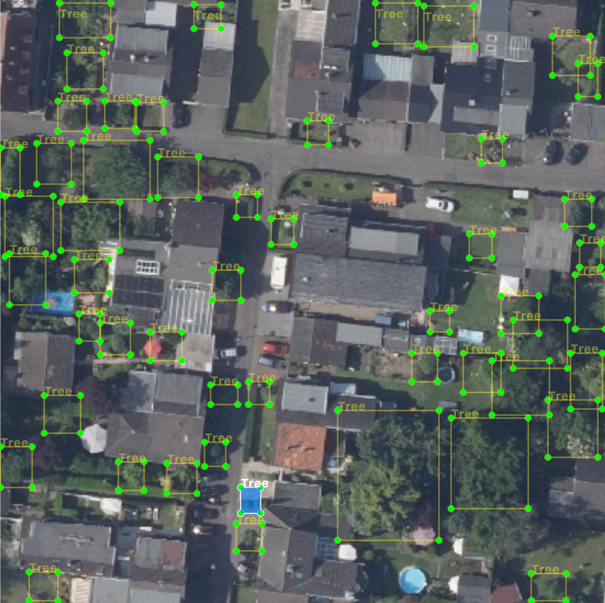

# tree-crown-detection
Identify tree crowns in orthographic/aerial image tiles by machine learning object detection.    

    
*Example display of predictions in label tool*    

This is based on [the deepforest project](https://deepforest.readthedocs.io/en/latest/), retrained (finetuned) on arial images of *urban* landscapes incl. young trees in respective surroundings such as streets.    

**Note**    
Labeling of tree crowns in orthographic images is more difficult than one might assume at first glance. This leads to quite few ground truth images (as of now), hence the data driven evaluation lacks right now.     
Still, the model could be improved for application on urban landscapes by retraining with around 150 additionally labeled ground truth images and the visual inspection also reflects this improvement.    

Further improvement and the important evaluation process are work in progress.     

The model is quite sensible to image resolution, hence use the best resolution available. Also, the required input shape is 400 x 400 pixel and the input images will be resized accordingly. Rule of thumb: "The crispier, the better."    


## Aerial images
There are many public sources available for obtaining aerial images, although there might be tremendous differences regarding the resolution (also depending on the requested timeframe where i.e. images from the early 2000s most likely have a significant lower resolution than current ones).    

As a starting point you might want to take check out [this link collection](https://wiki.openstreetmap.org/wiki/Vertical_Aerial_Photographs).    

Have a look at https://github.com/zushicat/crawler-NRW-aerial-images if you are interested in requesting (current and historic) aerial images of North Rhine-Westphalia, Germany.


## Usage
Install the environment
```
$ pipenv install
```

Place the orthographic images in subfolders into /data/image_data i.e. 
```
/data/image_data/my_images_to_predict
```
and start the prediction script
```
$ cd src
$ python predict.py
```

A folder of the same directory name will be created in /data/predictions and the subfolders /csv and /xml will be created, storing the predictions in the respective format.

